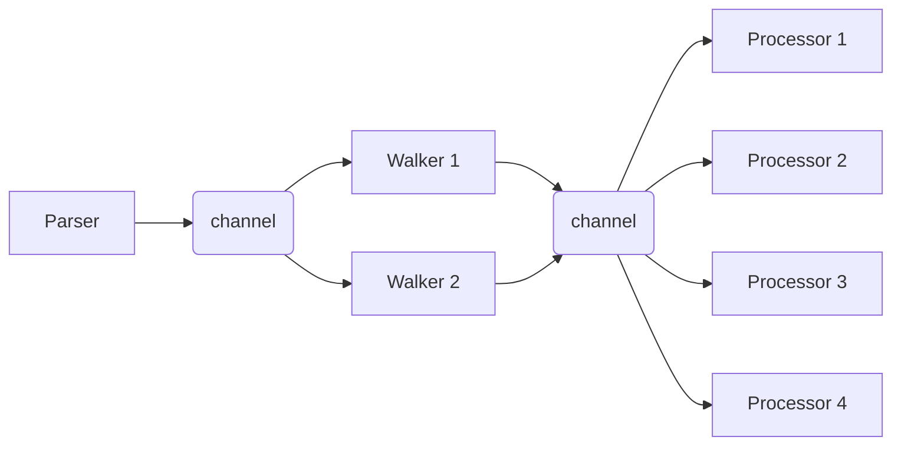

# azstorage

A command line tool for daily operations on Azure Storage Accounts.

## Usage

### azstorage remove

```
Deletes the blobs listed in the specified file

Usage:
  azstorage remove [flags]

Flags:
      --account string     the name of the storage account
      --container string   the name of the blob container
  -h, --help               help for remove
      --list-file string   path to the file containing directories to delete
      --processors int     the number of concurrent processors deleting found blobs (default 16)
      --walkers int        the number of concurrent directory walkers (default 4)
```

The options `account`, `container`, and `list-file` are required to specify.

The storage account key must be specified using an environment variable `AZURE_STORAGE_ACCOUNT_KEY`.

Invoke the command as follows:
```
AZURE_STORAGE_ACCOUNT_KEY=<account key> azstorage remove --account <account name> --container <container name> --list-file <path/to/your/list>
```

Each line in the list file, which is specified by `--list-file`, holds a name of a blob or a directory.
The name of directory must end with slash `/`.
The blank lines and lines starting with `#` are skipped.

An example of list file:
```
dir1/
dir2/subdir1/
dir3/subdir2/subdir3/
```

**Caution**: The following list will delete all blobs in your container.
```
/
```

### Architecture



* _Parser_ parses the list file and produces directories.
* _Walker_ searches blobs for a directory and produces blobs.
* _Processor_ deletes a found blob.

## How to build

### Prerequisites

* [Go](https://go.dev/dl/) 1.22 or higher

```
sudo apt install golang-go make
```

### Building with make

```
make
```
